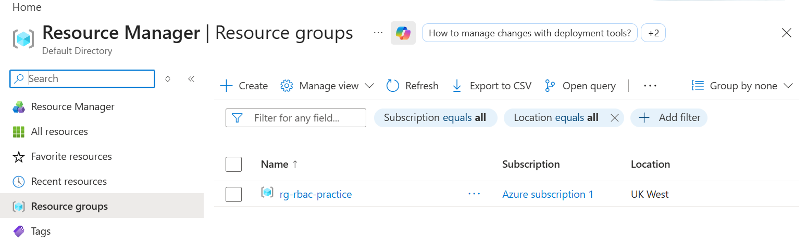
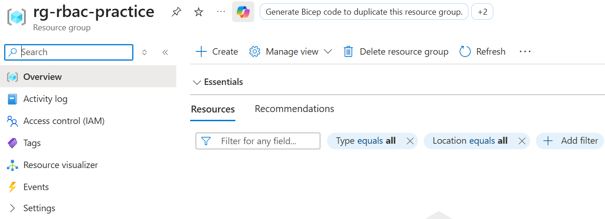
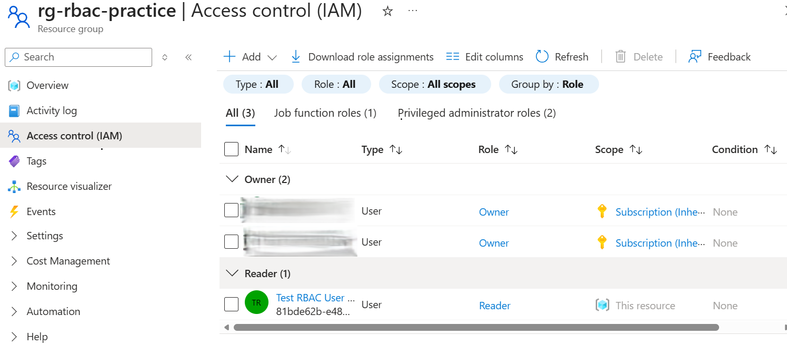
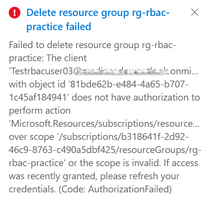

# 📘 Day 1 — Your First RBAC Assignment: Give Without Giving Too Much

## 🔍 Overview
Day 1 focuses on Azure Role-Based Access Control (RBAC), the foundation of cloud security.  
The goal is simple but essential: **assign the Reader role to a test user at the resource group scope**, allowing them to view resources but preventing them from modifying or deleting anything.

This teaches the principle of **least privilege**, one of the most important security practices in Azure.

---

## 🧰 Tools Used
- Azure Portal  
- Microsoft Entra ID  
- Azure RBAC (IAM)

---

## 🧪 What I Did
- Created a resource group named **rg-rbac-practice**  
- Created a test user in Microsoft Entra ID  
- Assigned the **Reader** role at the resource group scope  
- Logged in as the test user to validate permissions  
- Confirmed the user could view but not create or delete resources  
- Verified the RBAC assignment in the IAM blade  

---

## 📸 Screenshots

### 1. Resource Group Created  


### 2. Resource Group Overview  


### 3. IAM Role Assignment  


### 4. Test User Permission Error  



---

## 📝 Steps Performed

### 1️⃣ Created the Resource Group
- Azure Portal → Resource groups → Create  
- Name: **rg-rbac-practice**  
- Region: **UK West**  
- Created successfully  

### 2️⃣ Created the Test User
- Microsoft Entra ID → Users → New user  
- Username: `testrbacuser@yourdomain.onmicrosoft.com`  
- Name: **Test RBAC User**  
- Temporary password copied  

### 3️⃣ Assigned the Reader Role
- Opened **rg-rbac-practice**  
- Access control (IAM) → Add role assignment  
- Selected **Reader**  
- Assigned to **Test RBAC User**  

### 4️⃣ Validated Permissions
- Logged in via Incognito as the test user  
- Attempted to create/delete resources  
- Received **AuthorizationFailed** (expected)  

### 5️⃣ Verified IAM Assignments
- Returned to main account  
- IAM → Role assignments  
- Confirmed:
  - Owner — you  
  - Reader — Test RBAC User  


---

## 📜 Commands Used 
```powershell
# No PowerShell commands were required for this challenge.
# All steps were completed through the Azure Portal UI.

## 🎓 What I Learned
- How RBAC controls access in Azure  
- The difference between roles, scopes, and principals  
- Why the Reader role is safe for audit-only access  
- How to assign roles at the resource group scope  
- How to validate least-privilege access using a test user  

## 🔑 Key Takeaway
Least privilege is the backbone of cloud security — give only what is needed, nothing more.


