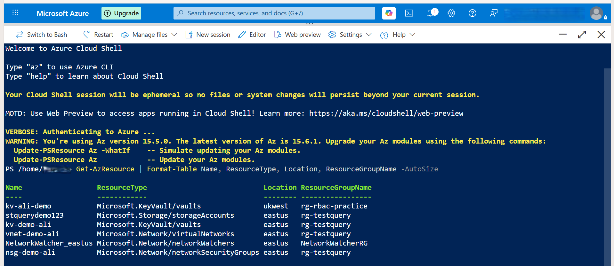
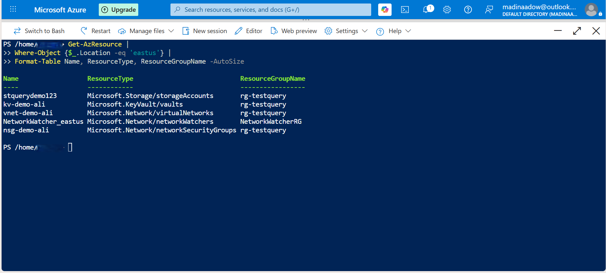
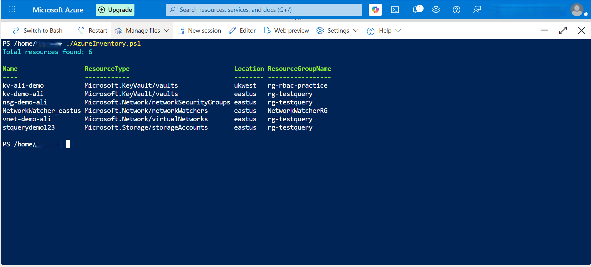

📘 Day 2 — Azure Resource Inventory (100 Days of Azure Challenge)
🔍 Overview
Today’s challenge focused on building an automated Azure Resource Inventory using PowerShell and Azure Resource Graph.
This is a real‑world cloud engineering task used in:

Cloud governance

Cost optimisation

Security reviews

Environment audits

Migration planning

By the end of this task, I produced:

A PowerShell script that queries all Azure resources

A CSV export of my environment

A visual inventory table

A filtered view

A script execution screenshot

This is the type of work cloud engineers do every day — and now it’s part of my portfolio.

🧠 What I Learned Today
✔ Azure Resource Graph basics
How to query Azure resources at scale using Search-AzGraph.

✔ PowerShell automation
How to collect, format, and export resource data.

✔ CSV reporting
How to generate structured reports for governance teams.

✔ Real‑world cloud inventory workflow
The same process used by cloud teams to understand what exists in an Azure subscription.

🛠 Tools & Technologies Used
Azure Cloud Shell (PowerShell)

Azure Resource Graph

PowerShell scripting

CSV reporting

GitHub for documentation

📜 PowerShell Script Used
This script collects all Azure resources across the subscription and exports them into a CSV file:

powershell
$resources = Search-AzGraph -Query "Resources | project name, type, location, resourceGroup"
$resources | Format-Table -AutoSize
$resources | Export-Csv -Path AzureInventory.csv -NoTypeInformation
🔎 What the script does:
Queries Azure Resource Graph

Selects key fields (Name, Type, Location, Resource Group)

Displays a formatted table

Exports results to AzureInventory.csv

This is a clean, efficient, and production‑friendly approach.

📊 Inventory Output (Screenshots)
Step 2 — Full Inventory Table

Step 3 — Filtered View

Step 5 — Script Execution

📁 Output Files in This Folder
File	Description
AzureInventory.ps1	PowerShell script used to collect the inventory
AzureInventory.csv	Exported list of Azure resources
step2-inventory-table.png	Screenshot of full inventory
step3-filtered-table.png	Screenshot of filtered results
step5-script-output.png	Screenshot of script execution

🧩 Real‑World Relevance
This task mirrors real cloud engineering responsibilities:

✔ Governance teams
Use inventories to track what exists and who owns it.

✔ Security teams
Use inventories to detect shadow IT and misconfigured resources.

✔ Cost management
Inventories help identify unused or oversized resources.

✔ Migration planning
Inventories are the first step before moving workloads.

This is not just a challenge task — it’s a real skill.

🚀 How to Run This Yourself
Open Azure Cloud Shell (PowerShell mode)

Run the script:

powershell
./AzureInventory.ps1
View the table output

Download the CSV

Use the data for reporting or analysis

🏁 Day 2 Complete
This was a strong, practical task that builds real cloud engineering muscle.
Tomorrow, I continue the journey — one day at a time.
