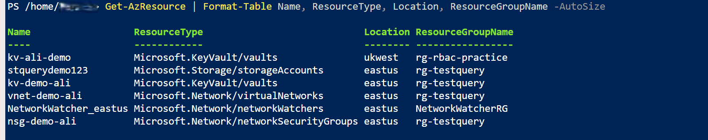
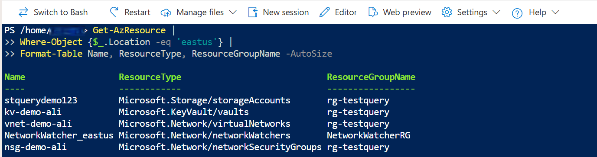
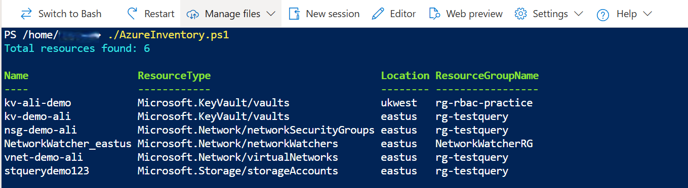
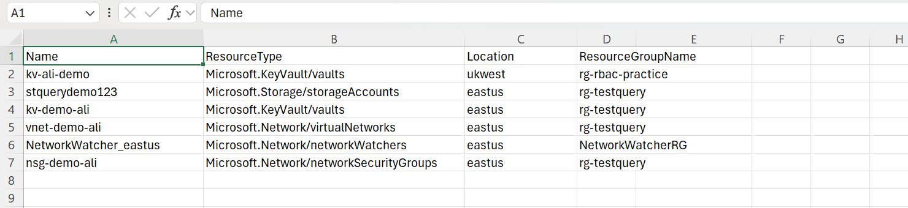

# 📘 Day 02 — Azure Resource Inventory & Governance Visibility

## Business Context
Cloud governance teams rely on accurate, up-to-date visibility of all deployed Azure resources.

A resource inventory is essential for:

- Security reviews
- Cost optimisation
- Ownership tracking
- Compliance audits
- Environment standardisation

Without a centralised inventory, organisations cannot manage or secure their cloud estate effectively.

---

## Objective
Collect a complete Azure Resource Inventory using Azure Resource Graph (via PowerShell), export the results to CSV, validate the output, and document the findings for governance and reporting.

---

## What I Did
- Queried Azure Resource Graph using `Search-AzGraph`
- Retrieved all resources with key metadata:
  - Name
  - Resource type
  - Location
  - Resource group
- Displayed the results in table format
- Exported the inventory to a CSV file
- Validated the output in Cloud Shell and Azure Portal
- Captured screenshots of each step
- Documented the workflow for governance visibility

---

## Skills Demonstrated
- Azure Resource Graph querying
- PowerShell automation
- Cloud Shell administration
- Governance & compliance awareness
- Inventory reporting
- Technical documentation

---

## Before & After Comparison

### Before
- No centralised view of Azure resources
- Hard to track what exists across the subscription
- No exportable inventory for audits or governance
- Limited visibility into resource distribution

### After
- Full inventory collected using Azure Resource Graph
- Exported CSV for reporting and analysis
- Clear visibility into resource metadata
- Governance-ready documentation created

---

## 🧩 Architecture Diagram (Simplified)

```text
Azure Subscription
       |
       |-- Azure Resource Graph
       |        |
       |        |-- Query (Search-AzGraph)
       |
       |-- Cloud Shell (PowerShell)
                |
                |-- Export CSV (AzureInventory.csv)
```

---

## 🔄 Governance Workflow (How This Inventory Is Used)

1. Collect resource inventory (this task)
2. Identify untagged or non-compliant resources
3. Apply governance policies (tags, naming standards, RBAC)
4. Review cost allocation and ownership
5. Automate recurring audits using Resource Graph queries
6. Feed results into dashboards or governance reports

---

## 📸 Screenshots

> Screenshots were sanitised to remove personal and tenant-specific information before publication.

### Step 2 — Inventory Table Output


### Step 3 — Filtered Resource View


### Step 5 — Script Execution Output


### Step 6 — CSV Export Preview


---

## 📊 Sample Inventory Output (Excerpt — Real Data)

| Name | Resource Type | Location | Resource Group |
|---|---|---|---|
| kv-ali-demo | Microsoft.KeyVault/vaults | ukwest | rg-rbac-practice |
| stquerydemo123 | Microsoft.Storage/storageAccounts | eastus | rg-testquery |
| kv-demo-ali | Microsoft.KeyVault/vaults | eastus | rg-testquery |
| vnet-demo-ali | Microsoft.Network/virtualNetworks | eastus | rg-testquery |
| NetworkWatcher_eastus | Microsoft.Network/networkWatchers | eastus | NetworkWatcherRG |
| nsg-demo-ali | Microsoft.Network/networkSecurityGroups | eastus | rg-testquery |

---

## ✅ Validation
- Confirmed that the Resource Graph query returned all resources successfully
- Verified that the CSV export contained accurate metadata
- Cross-checked results with Azure Portal
- Ensured the table output matched the exported file

---

## ⚙️ Automation & Scripting

### PowerShell Commands Used

```powershell
# Query Azure Resource Graph
$resources = Search-AzGraph -Query "Resources | project name, type, location, resourceGroup"

# Display results
$resources | Format-Table -AutoSize

# Export to CSV
$resources | Export-Csv -Path AzureInventory.csv -NoTypeInformation
```

### Azure CLI Equivalent

```bash
az graph query -q "Resources | project name, type, location, resourceGroup"
```

---

## 🛠️ Troubleshooting
- Cloud Shell may require re-authentication if idle
- CSV export paths must exist in Cloud Shell storage
- Some resources may not appear if permissions are limited
- Resource Graph queries require the ResourceGraph module installed (Cloud Shell includes it by default)

---

## 🌍 Why This Matters
A resource inventory is the foundation of:

- Governance
- Security
- Cost management
- Compliance
- Operational planning

You cannot secure or optimise what you cannot see.

---

## 🎓 What I Learned
Azure Resource Graph provides a fast, scalable way to query resources across an entire subscription.

Exporting results enables better governance, reporting, and long-term operational clarity.

---

## 🔑 Key Takeaway
A complete Azure Resource Inventory is the first step toward strong cloud governance and operational excellence.
