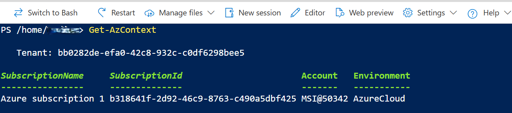
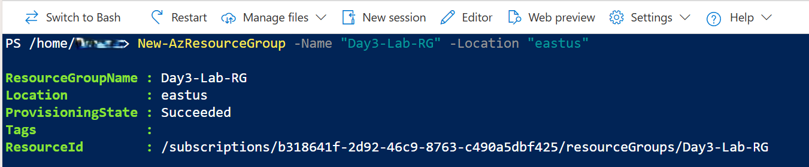
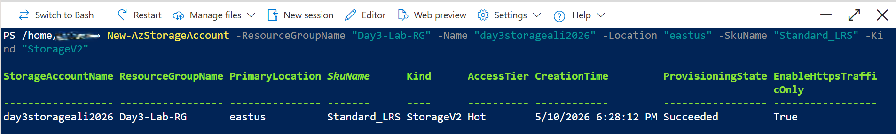
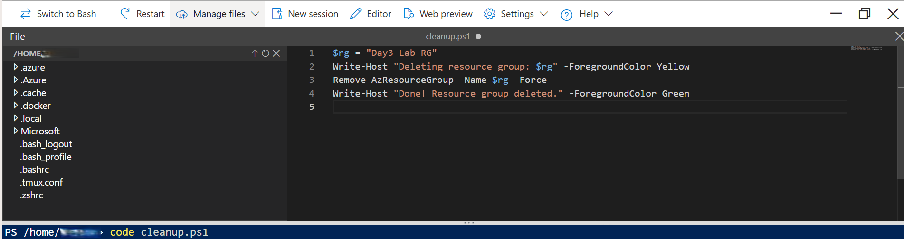
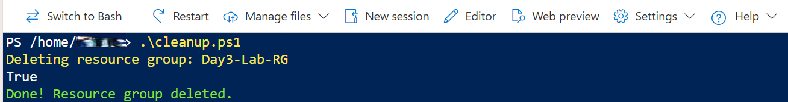

# 📘 Day 3 — Your First Azure Automation Script: Stop Clicking, Start Scripting

## 🔍 Overview
Day 3 was all about shifting from manual Azure Portal clicking to real automation using PowerShell. I created a Resource Group, deployed a Storage Account, wrote a cleanup script, and executed it to automatically delete everything. This challenge builds the mindset of a true cloud engineer: automate anything you do more than once.

## 🧰 Tools Used
- Azure Cloud Shell (PowerShell)
- Azure PowerShell Az Module

## 🧪 What I Did
- Verified Azure authentication using `Get-AzContext`
- Created a Resource Group in the *eastus* region
- Deployed a globally unique Storage Account
- Wrote a PowerShell cleanup script using the Cloud Shell editor
- Executed the script to delete all resources automatically
- Validated that the Resource Group was fully removed

## 📸 Key Screenshots

### 1. Azure Context Check  


### 2. Resource Group Created  


### 3. Storage Account Created  


### 4. Cleanup Script in Editor  


### 5. Cleanup Script Executed  


## 📜 Commands Used

```powershell
# PowerShell Commands

# Check Azure context
Get-AzContext

# Create Resource Group
New-AzResourceGroup -Name "Day3-Lab-RG" -Location "eastus"

# Create Storage Account
New-AzStorageAccount -ResourceGroupName "Day3-Lab-RG" -Name "day3storageali2026" -Location "eastus" -SkuName "Standard_LRS" -Kind "StorageV2"

# Open Cloud Shell editor to create cleanup script
code cleanup.ps1

# Inside cleanup.ps1:
$rg = "Day3-Lab-RG"
Write-Host "Deleting resource group: $rg" -ForegroundColor Yellow
Remove-AzResourceGroup -Name $rg -Force
Write-Host "Done! Resource group deleted." -ForegroundColor Green

# Run cleanup script
.\cleanup.ps1

# Final validation
Get-AzResourceGroup | Where-Object {$_.ResourceGroupName -eq "Day3-Lab-RG"}

## 🎓 What I Learned
- How to automate Azure tasks using PowerShell instead of the portal  
- How to create and delete Azure resources programmatically  
- How to write and execute scripts in Azure Cloud Shell  
- Why automation reduces human error and speeds up deployments  
- The importance of globally unique naming for Storage Accounts  

## 🔑 Key Takeaway
Automation is the difference between clicking like a beginner and deploying like a cloud engineer.

