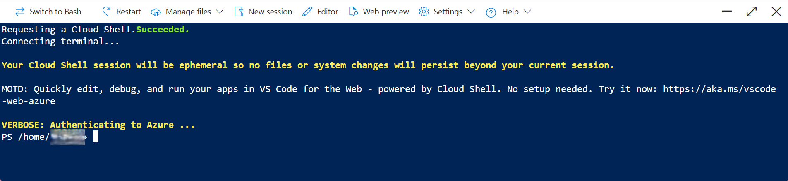
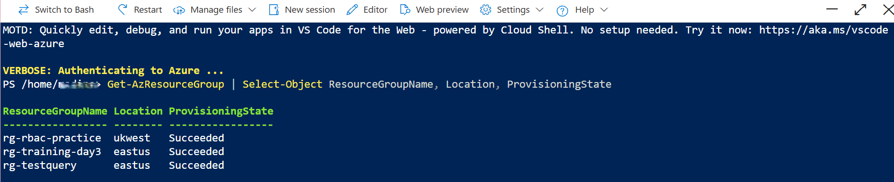
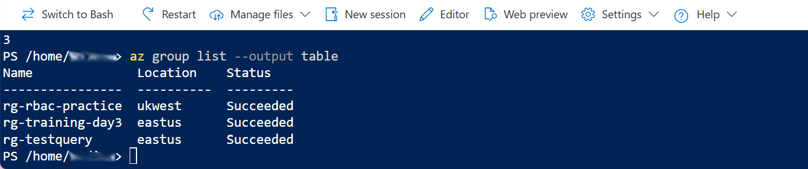
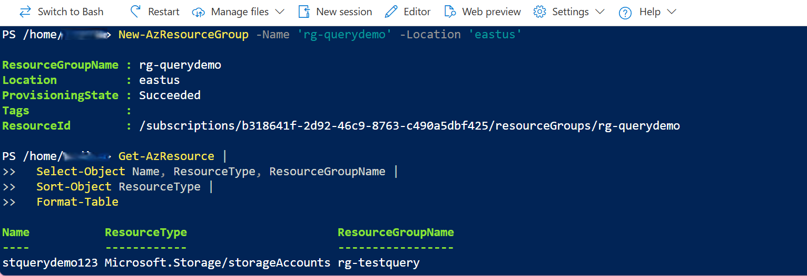
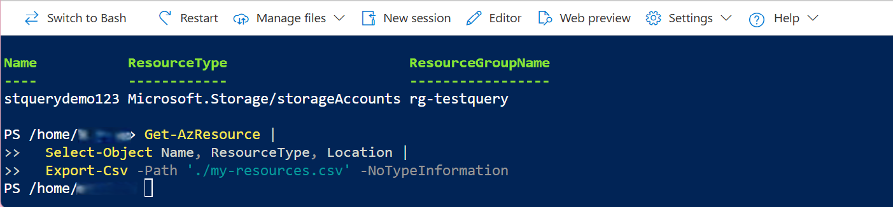

# 📘 Day 4 — Querying Azure Resources (PowerShell + Azure CLI)

## 🔍 Overview
In this challenge, I used **Azure Cloud Shell** to query Azure resources using both **PowerShell** and **Azure CLI**.  
This is an essential skill for cloud engineers because it helps with:

- Inventory reporting  
- Governance  
- Cost analysis  
- Troubleshooting  
- Understanding subscription structure  

I used my existing resource group **rg-testquery**, so no new resources were created.

---

## 🧰 Tools Used
- Azure Cloud Shell (PowerShell mode)  
- Azure CLI  
- PowerShell object filtering  
- JMESPath queries  
- CSV export  

---

## 🧪 What I Did
- Opened Cloud Shell in PowerShell mode  
- Listed all resource groups  
- Counted resource groups  
- Queried resource groups using Azure CLI  
- Filtered CLI output using JMESPath  
- Listed all resources in the subscription  
- Sorted resources by type  
- Exported resource data to CSV  
- Previewed the CSV file  
- Confirmed the file existed  
- Converted CLI JSON output into PowerShell objects  

---

## 📸 Key Screenshots  
**Full set of 10 screenshots is available in the `/screenshots` folder.**  
Below are the 5 most important ones.

### 1. Cloud Shell Open  


### 2. List Resource Groups (PowerShell)  


### 3. List Resource Groups (Azure CLI)  


### 4. List All Resources (PowerShell)  


### 5. Export to CSV  


---

## 📜 Commands Used

```powershell
# -------------------------
# PowerShell Commands
# -------------------------

Get-AzResourceGroup
(Get-AzResourceGroup).Count

Get-AzResource |
  Select-Object Name, ResourceType, ResourceGroupName |
  Sort-Object ResourceType |
  Format-Table

Get-AzResource |
  Select-Object Name, ResourceType, Location |
  Export-Csv -Path './my-resources.csv' -NoTypeInformation

Get-Content './my-resources.csv' | Select-Object -First 5
ls -la

az resource list --output json | ConvertFrom-Json


# -------------------------
# Azure CLI Commands
# -------------------------

az group list --output table

az group list \
  --query "[].{Name:name, Location:location}" \
  --output table

az resource list


🧩 Sample Output (Excerpt)
Name    ResourceType    Location
vm1 Microsoft.Compute/virtualMachines   uksouth
vnet1   Microsoft.Network/virtualNetworks   uksouth
storage123  Microsoft.Storage/storageAccounts   uksouth


🎓 What I Learned
PowerShell works with objects, making filtering and exporting easy

Azure CLI works with JSON, ideal for clean table output

Both tools can be used together in Cloud Shell

Sorting resources helps understand subscription structure

CSV export is useful for audits and reporting

CLI JSON can be converted into PowerShell objects for deeper analysis

🔑 Key Takeaway
PowerShell and Azure CLI complement each other — using both gives you full visibility and control over your Azure environment

