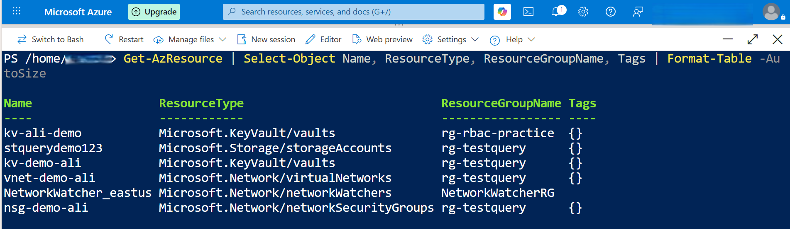
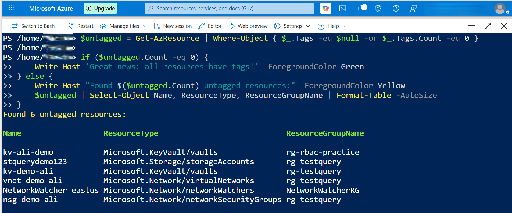
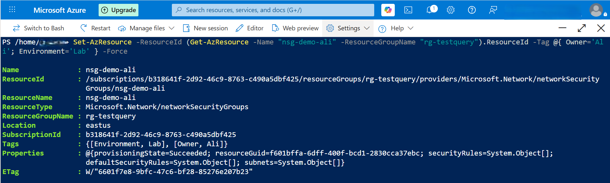
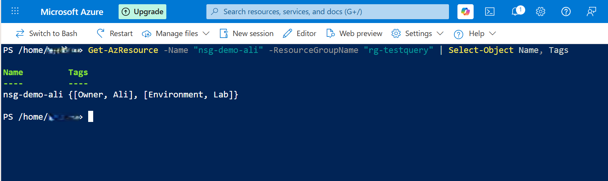

Day 5 – Azure Resource Tagging & Audit (PowerShell)
Overview
In this task, I used Azure Cloud Shell with PowerShell to audit untagged resources, apply tags, and validate them. Tagging helps with cost management, governance, and resource organisation.

Step 3 – List All Resources With Tags Column
powershell
Get-AzResource | Select-Object Name, ResourceType, Tags
Screenshot:  

Step 4 – Identify Untagged Resources
powershell
Get-AzResource | Where-Object { -not $_.Tags } | Select-Object Name, ResourceType
Screenshot:  

Step 5 – Apply Tags to a Resource
powershell
Set-AzResource -ResourceId (Get-AzResource -Name "nsg-demo-ali" -ResourceGroupName "rg-testquery").ResourceId -Tag @{ Owner='Ali'; Environment='Lab' } -Force
Screenshot:  

Step 6 – Validate the Tags
powershell
Get-AzResource -Name "nsg-demo-ali" -ResourceGroupName "rg-testquery" | Select-Object Name, Tags
Screenshot:  

My Notes
What I did
I listed all resources, checked which ones had no tags, attempted tagging multiple resource types, and successfully tagged an NSG. I then validated the tags using PowerShell in Cloud Shell.

What I learned
Different Azure resources handle tags differently. NSGs accept tags easily, while VNets and Key Vaults require specific cmdlets or API paths and reject the simple .Tags update.

Issues I hit
Tagging failed on Key Vaults and VNets due to API restrictions, causing PowerShell conversion errors. The NSG accepted tags without any issues.

Commands I used
Get-AzResource, Where-Object, Select-Object, Set-AzResource, and a validation query to confirm the tags were applied.
